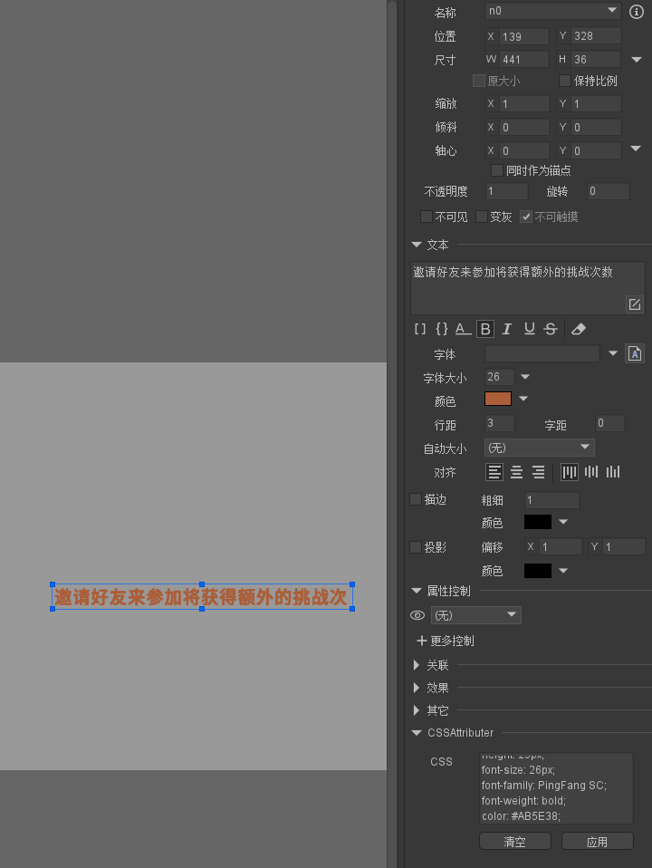

# FairyGUI-Editor-Plugins

## 包名窜改插件[PackageTamper]
- 编辑器版本：FairyGUI-Editor_2021.3.0
- 发布时，根据pkgId中的标识符$，窜改包括$标识符后面的字符，达到包名修正的效果，example:[6exut6s4$1]=>[6exut6s4]

### 附主题换肤方案：

参考项目[PackageTamper](./assets/PackageTamper),内含UI工程以及Laya项目工程,[点击预览](/assets/PackageTamper/release/)

UI工程简单说明
- Pet [主包,里面不含图片资源,图片资源采用跨包引用Assets]
- Assets   [主题图集初始包,内容被跨包引用,用作编辑器可视化编辑]
- Assets-blue [主题图集包,通过Assets复制而来,替换对应的主题图片,为了被发布和编辑器读取,需要手动在pkgId后面增加标识符$+数字,发布时将会被插件修正成Assets的pkgId,同时记得调整发布路径地址和发布文件名和Assets一致]
- Assets-yellow [同上]

代码调整,参考Laya工程

## CSS样式应用插件[CSSAttributer]

- 编辑器版本：FairyGUI-Editor_2021.3.0
- 结合[蓝湖](https://lanhuapp.com/)、[像素大厨](https://www.fancynode.com.cn/pxcook)等支持设计图自动生成样式CSS代码切图标注平台，一键将CSS代码转换为Fairygui元件对应的属性。

