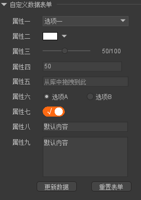

## 自定义数据表单生成器[CustomAttributer]

- 编辑器版本：FairyGUI-Editor_2021.3.0
- 一个可配置自定义数据表单生成器,支持组件和父级组件，本地&远程配置，内含9种自定义表单项。



### 如何配置表单
修改本插件同目录下的config.json文件即可
### 内置表单项
```
    TEXTINPUT // 文本输入框
    TEXTAREA // 文字输入区
    COMBOBOX // 下拉框
    COLORINPUT // 颜色输入框
    NUMBERINPUT // 数字输入框
    SLIDER // 滑动块
    RESOURCEINPUT // 资源选择器
    RADIOBOX // 单选框
    SWITCH // 切换器
```
### 表单配置参数参考
```
{
    "remote": "", // 自定义远程路径
    "inspectors":[
        {
            "title": "自定义数据表单", 
            "parent": false, // 修改的组件主体类型：true:父级|false:子级
            "pattern": "*", // 组件名称匹配，支持正则
            "mode": 1, // 插件模式：1【设置模式】|0【读取模式】（todo）
            "components": [
                {
                    "type": "ComboBox",
                    "id": 1001,
                    "name": "属性一",
                    "key":"ComboBox",
                    "data": {
                        "items": [
                            "选项一",
                            "选项二",
                            "选项三"
                        ],
                        "values": [
                            "选项一",
                            "选项二",
                            "选项三"
                        ]
                    },
                    "value": 0
                },
                {
                    "type": "ColorInput",
                    "name": "属性二",
                    "key":"ColorInput",
                    "id": 1002,
                    "values": "#ffffff"
                },
                {
                    "type": "Slider",
                    "name": "属性三",
                    "id": 1003,
                    "key":"Slider",
                    "value": 50,
                    "data":{
                        "min":0,
                        "max":100
                    }
                },
                {
                    "type": "NumberInput",
                    "name": "属性四",
                    "key":"NumberInput",
                    "id": 1004,
                    "value": 50,
                    "data":{
                        "min":0,
                        "max":100,
                        "step":1
                    }
                },
                {
                    "type": "ResourceInput",
                    "name": "属性五",
                    "key":"ResourceInput",
                    "id": 1005,
                    "value": ""
                },
                {
                    "type": "RadioBox",
                    "name": "属性六",
                    "key":"RadioBox",
                    "id": 1006,
                    "value": 0,
                    "data":{
                        "items":["选项A","选项B"]
                    }
                },
                {
                    "type": "Switch",
                    "name": "属性七",
                    "key":"Switch",
                    "id": 1007,
                    "value": true
                },
                {
                    "type": "Textinput",
                    "name": "属性八",
                    "key":"Textinput",
                    "id": 1008,
                    "value": "默认内容"
                },
                {
                    "type": "Textarea",
                    "name": "属性九",
                    "key":"Textarea",
                    "id": 1009,
                    "value": "默认内容"
                }
            ] 
        }
    ]
    
}
```

### todo 
- [x] 多组件配置
- [ ] 表单子项关联显隐
- [ ] 【读取模式】一键复制组件属性  